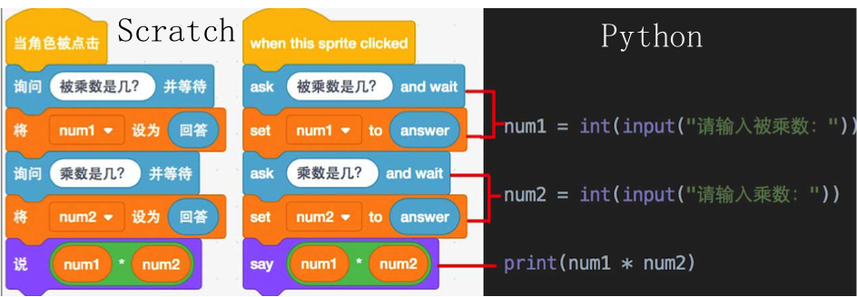
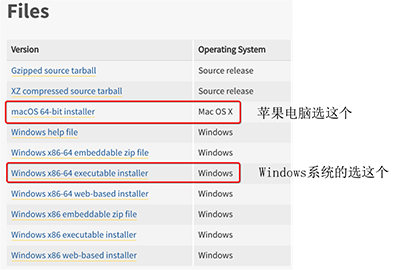
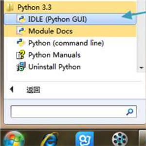
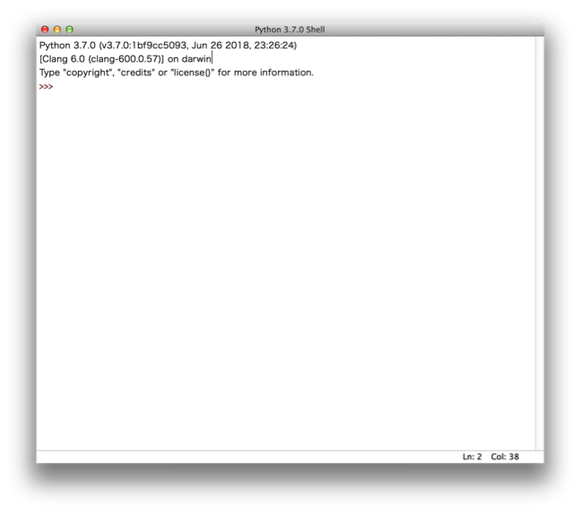
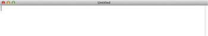

# 第0课：写在开课前

## 教学目的 
安装好Python的开发运行环境  
 
## 初识Python
Hi,大家好，我是葫芦妈妈！从这里开始，我们将要学习一门新的编程语言—Python。  
Python在英文中是大蟒蛇的意思，所以Python的Logo就是由一黄一蓝两条大蟒蛇构成  

## Python能做什么
Python拥有强大的功能，被广泛用于数据处理、人工智能、网站开发、网络爬虫、系统运维等领域，全世界每天都有成千上万的专业人士在使用这种语言改变着世界，甚至包括NASA，Google，腾讯、阿里巴巴这些著名的机构和大公司也在使用着Python。

对于小朋友们来说，Python还是个好玩的工具，不但能创作神奇的图画、开发属于自己的小游戏、小工具，还能帮你解决烧脑的逻辑推理题，连你最不擅长的奥数题Python处理起来也是轻而易举。在我们后面的课程里，我会 一 一带你领略Python这个工具的强大本领。

## Python和Scratch的区别
有一些小朋友已经学习过Scratch的课程了，Scratch是一种图形化编程语言，只需要将指令模块拖动到脚本区，按照一定的逻辑拼在一起，就组成了可以运行的程序。

而Python语言是真正的编程语言，需要用键盘输入代码，编写Python语言的关键字和语法规则，才能得到可以执行的程序。

下图是分别使用Scratch和Python两种语言编写的计算两数相乘的代码。程序逻辑很简单，都是由用户输入被乘数和乘数，然后输出积。对比英文的Scratch程序和Python程序，是不是长得很像？

其实Python代码更为简洁，也更接近我们人类的自然语言。在众多的编程语言中，Python也以语法简洁而著称。 

## 课前准备工作—安装Python
要想在计算机上使用Python，我们需要在计算机上安装Python   

### 下载Python
Python是免费的，目前最新的稳定版本是Python3.8.1，使用浏览器直接访问他的官网下载页面    
<https://www.python.org/downloads/release/python-381/>    
拉到页面底部，选择你电脑对应的版本    
   

### 安装Python
跟随提示一步步进行，安装程序将使用默认设置把Python安装到你的电脑上。页面出现Successful字样，说明安装成功     
安装完成后，要去哪里找到Python呢？   
如果你的电脑是苹果系统，就要先找到这个小图标，进入到启动面板里。    

  
然后找到上面画着两条蟒蛇的 IDLE 图标， 点击这个图标就可以了    
 

如果你是windows系统，要到“开始”菜单下，点击“所有程序”，找到Python3.8 点开，然后点击IDLE就可以了
 

### 使用Python编辑器
IDLE是Python的集成开发环境，它包括了Python Shell 和 Python Editor两部分。   
我们点击IDLE打开的就是Python Shell。它是一个窗口，允许用户输入命令或者代码行   
“>>>”叫做提示符，它表示Python已经准备就绪，等待输入Python指令了。   

 

通常，我们想要编写的程序至少也要有几行的代码，会需要代码高亮、缩进、关键字提示、撤销、恢复等功能，因此Python提供了一个编辑器，用来方便编写较长的程序。在IDLE中，打开”File”菜单，选择“New File”会弹出一个空白屏幕，这就是Python编辑器（Python Editor）了   
 

我们后面的课程中，都会用到这个编辑器。   

## 小结

现在你应该：   
* 有了完全能使用的Python编辑环境    
* 知道从哪里找到Python Shell    
* 知道如何从Python Shell中调出Python编辑器   
* 准备好开始学习Python   
