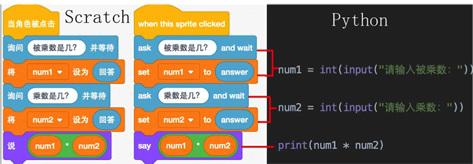
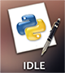

# 第0课：写在开课前

| 教学目的 |
| :----: |
| 安装好Python的开发运行环境 |

Hi,大家好，我是葫芦妈妈！从这里开始，我们将要学习一门新的编程语言—Python。
Python在英文中是大蟒蛇的意思，所以Python的Logo就是由一黄一蓝两条大蟒蛇构成

## Python能做什么
Python拥有强大的功能，被广泛用于数据处理、人工智能、网站开发、网络爬虫、系统运维等领域，全世界每天都有成千上万的专业人士在使用这种语言改变着世界，甚至包括NASA，Google，腾讯、阿里巴巴这些著名的机构和大公司也在使用着Python。

对于小朋友们来说，Python还是个好玩的工具，不但能创作神奇的图画、开发属于自己的小游戏、小工具，还能帮你解决烧脑的逻辑推理题，连你最不擅长的奥数题Python处理起来也是轻而易举。在我们后面的课程里，我会 一 一带你领略Python这个工具的强大本领。

## Python和Scratch的区别
有一些小朋友已经学习过Scratch的课程了，Scratch是一种图形化编程语言，只需要将指令模块拖动到脚本区，按照一定的逻辑拼在一起，就组成了可以运行的程序。

而Python语言是真正的编程语言，需要用键盘输入代码，编写Python语言的关键字和语法规则，才能得到可以执行的程序。

下图是分别使用Scratch和Python两种语言编写的计算两数相乘的代码。程序逻辑很简单，都是由用户输入被乘数和乘数，然后输出积。对比英文的Scratch程序和Python程序，是不是长得很像？

其实Python代码更为简洁，也更接近我们人类的自然语言。在众多的编程语言中，Python也以语法简洁而著称。 

## 课前准备工作—安装Python
要想在计算机上使用Python，我们需要在计算机上安装Python

### 下载Python
Python是免费的，目前最新的稳定版本是Python3.8.1，使用浏览器直接访问他的官网下载页面

<https://www.python.org/downloads/release/python-381/>
拉到页面底部，选择你电脑对应的版本

### 安装Python
跟随提示一步步进行，安装程序将使用默认设置把Python安装到你的电脑上。页面出现Successful字样，说明安装成功    
安装完成后，要去哪里找到Python呢？   
如果你的电脑是苹果系统，就要先找到这个小图标，进入到启动面板里。  
    
然后找到上面画着两条蟒蛇的 IDLE 图标， 点击这个图标就可以了    
 