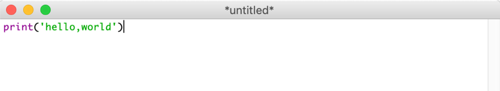
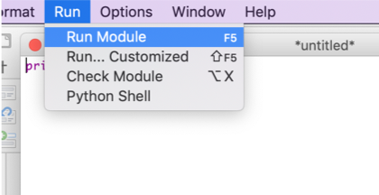
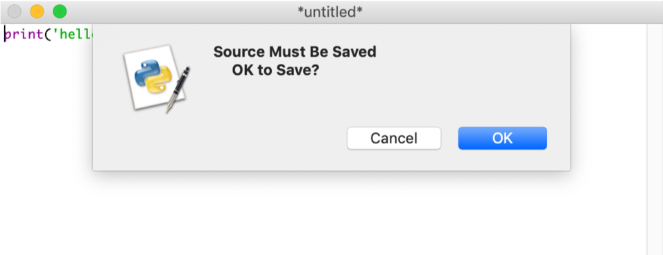
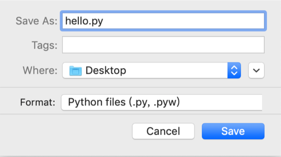
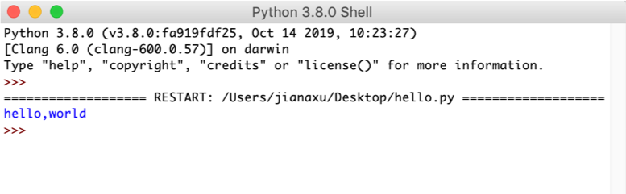
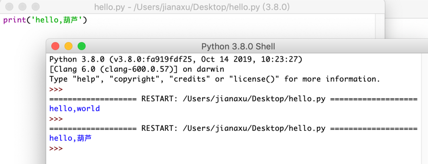
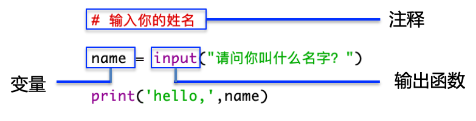

# 第1课：从Hello World开始

Hi,大家好，我是葫芦妈妈。今天我们就要正式开始学习Python编程了   

课前你应该都已经安装好了Python的开发环境，那现在请按照课前提示点击IDLE进入到Python Shell吧。  
然后选择File->New File命令，就会打开一个Python编辑器窗口，其顶部带有一个Untitled标题。

## 从 hello,world开始
按照惯例，程序员在学习一门语言时，写的第一行代码通常是 “hello , wold” 。这行代码非常简单，它只是向计算机屏幕输出了 “hello , wold”这样一句字符串。  

在Python的中向屏幕输出这句话要用print(‘hello,world')，print在英文中是打印的意思，也就是告诉计算机请打印出hello,world这几个字。我们一起来试一下，注意这里输入的时候一定要将输入法切换到英文输入状态哦   



print是Python语言的输出函数，在编辑器里函数用紫色显示，hello world是一串字符串，在编辑器里字符串默认用绿色显示。

接着，点击编辑器窗口上方的菜单Run—>Run Module   


这时会弹出一个对话框，提示你要先保存程序代码   

  
    
点击“确定”或者“OK”按钮，在弹出的对话框中输入文件名hello.py，选个保存的目录（这里我选的是桌面，你可以请爸爸妈妈帮忙建个你专属的文件夹）。保存后Python Shell窗口就会被激活，你的第一行代码将被执行，执行结果显示在<<< 提示符后面   
    

好了，你已经编写完第一个Python程序了。

当程序可以正常运行后，试着修改代码中的一些值，观察代码的变化，可以直观的了解代码的作用，    
比如我把 hello, wold改成 hello, 葫芦，print(“hello,葫芦”)    
这里“葫芦”是中文，输入的时候要注意中英文切换，在Python中只有***引号里面的字符串和注释中可以有中文字符***，其他不管是关键字还是字符（比如括号，引号）都必须是***英文***哦    
 

## 更进一步
我们再来给代码加点好玩的，让程序代码询问电脑前的用户姓名，然后把名字打印出来    
回到编辑窗口，输入下面几行代码，注意中英文切换    
```Python
# 输入你的姓名
name = input("请问你叫什么名字？")
print('hello,',name)
```
 

这里红色的那一行叫做“注释”，注释以井号（#）开头，它是程序的提示，是告诉看代码的人这段代码的作用，不是给计算机看的，所以计算机运行时会忽略它。    
input是Python语言的输入函数，当你想让使用你程序的人告诉计算机一些信息时，需要使用input语句。    
Name在这里叫做“变量”，变量是一个保存数据的地方，当我们需要在程序里保存数据时，我们就需要定义一个变量，比如这里用户输入的名字，我们后面还要将这个名字打印出来，必须先把这个名字找个地方存上，等到print时直接到name中把名字取出来就好了。    
中间的等号=，是个赋值运算符，表示把右边得到的值赋给左边的变量     
在给变量命名时，要给他取个有意义的名字，让别人一看就知道它存的是什么数据。Python规定变量名要使用英文字母、数字和下划线来命名，但是不能以数字开头，也不能使用Python关键字作为变量名    
  

点击运行，保存后，Shell窗口又被激活，在光标后面输入你的名字     
 
 

## 小结

现在你应该：   
* 可以顺利从Python Shell中调出Python编辑器，大概知道他俩的区别   
* 可以在Python编辑器中编写代码，并且知道如何保存、运行你的代码   
* 会写两行Pytho代码了，知道如何切换中英文   
* 了解了变量、输入输出函数(input、print)     
*  准备好尝试第2课跟有趣的程序   


### 葫芦的疑问：
Q: 为什么使用Python编辑器，而不是直接在Python Shell中编辑代码呢？   
 
A:  Python Shell也可以输入并且运行代码，但无法保存代码，所以每次运行后如果还想编辑或者运行代码，就需要全部重新输入，当代码量多的时候，这很不方便。    

Python编辑器除了能够编辑代码，还提供了许多编写代码时的辅助功能，比如：撤销、恢复、代码高亮、智能缩进、语法提示、自动完成等。此外他还支持多窗口，能同时编辑多个Python程序     

如果你只有一行代码（比如print(‘hello,world’)）可以直接在Python Shell中输入并且运行；但如果你多于一行代码，还是打开Python编辑器吧    