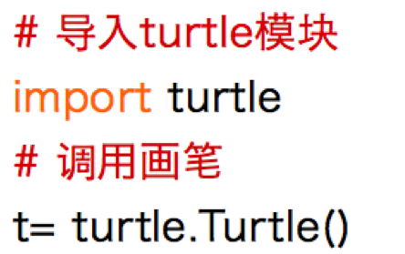
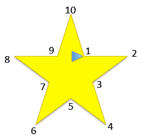
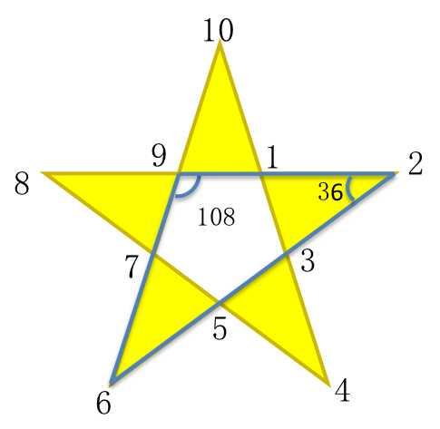
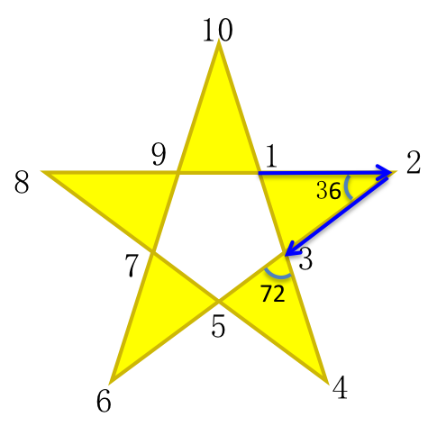
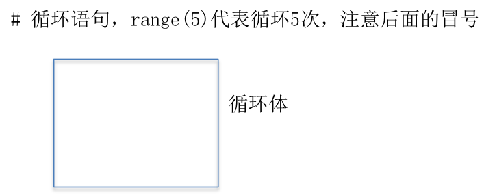
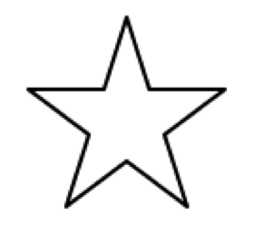
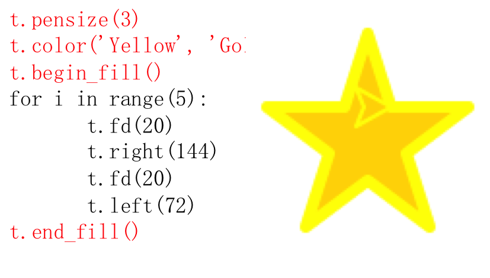
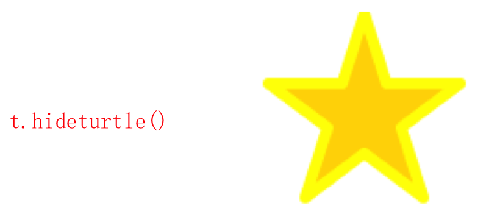

# 第三课 Python会画画-画一个金灿灿的五角星

Hi,大家好，我是葫芦妈妈。上节课我们学习了画简单的几何图形，但都是黑白线条的，有点无聊。   

这节课我们要进一步学习turtle的绘图功能，画一个金灿灿的五角星，就像这样       
<div align="center">

</div>

## 第一步 画图准备
回忆一下上节课的代码，要先做准备工作，将turtle模块导入到程序中，然后将绘图工具交给变量t。

<table>
<tr>
<td>第一步，画图准备：</td>
<td width="444px">

</td>
</tr>
</table>

如何画一个五角星呢？我们观察可以发现，五角星是由5个等腰三角形围在一起组成的，只要从其中的一个点开始，沿着每个三角形的外围依次描边，就能将五角星的轮廓勾勒出来。   
<div align="center">

</div>

先来画第一个角——利用上节课学的前进(fd),左转(left),右转(right)命令，让画笔从1号点开始向前移动到2号点，然后画笔向右转向3号点的方向，继续移动到3号点后，再左转转向4号点的方向，每次转弯的角度需要计算一下：
<table>
    <tr>
        <td>
            <p>1、正多边形内角和=180*（n-2）所以，正五边形每个内角为108度</p>
            <p>2、由2、7、9这三个角组成的等腰三角形中，9对应的角是108度，所以2和6对应的角为36度</p>
        </td>
        <td width="444px">
            
        </td>
    </tr>
    <tr>
        <td>
            <p>3、当画笔从1移动到2的时候，它是水平移动的，也就是画笔是面向屏幕右侧的，它需要向右转144度，才能继续向3的方向移动</p>
        </td>
        <td width="444px">
            
        </td>
    </tr>
    <tr>
        <td>
            <p>4、画笔移动到3后，五角星的第一个角就画好了，但还需要左转72度面向4的方向，准备下一个角的描画</p>
        </td>
        <td width="444px">
            
        </td>
    </tr>
</table>

## 第二步，用循环画五角星
五角星的其中一个角就画好了；5个角的边长和角度都是相同的，所以只要重复上述步骤5次，就能将五角星的五个角画完    

***在程序设计中，如果要编写包含重复执行步骤的程序，可以使用循环结构来实现。***
这段代码中，循环的次数是确定的——5次，所以使用for循环，也叫计数循环，使用语句for i in range(5) : 这句话的意思是让操作步骤执行5次，将要执行的动作放入循环体内，就像这样：

<table>
    <tr>
        <td>第二步，用循环画五角星</td>
        <td>
            
        </td>
        <td>
            
        </td>
    </tr>
</table>

执行一下代码，现在我们就得到五角星的轮廓了    

## 第三步，填充颜色
我们希望有个金灿灿的五角星，所以要给三角形填充上颜色。海龟画图中，设置颜色的语句是color(),填充颜色的语句是bengin_fill()和end_fill()。先使用color(‘Gold’)语句将五角星设置为金色，然后将绘制图形的代码放到bengin_fill()和end_fill()两条语句之间，当执行到end_fill()语句时就会使用指定的颜色填充图形。     

这里有个小提示，color(‘Gold’)代表将图形的外框和内部都变成金色，也可以用color(‘Yellow’,’Gold’)将画笔设为黄色，而将图形填充为金色。另外，如果只想改变填充颜色使用fillcolor()语句代替color()语句即可。    

为了营造五角星的发光效果，我们还需要让画笔粗一些，使用pensize()语句调整画笔的粗细，括号里面填入一个数值

<table>
    <tr>
        <td>第三步，填充颜色</td>
        <td>
            
        </td>      
    </tr>
</table>

画好了，但是画笔还留在五角星上，看起来怪怪的，没关系，我们可以让画笔隐藏掉，使用hideturtle()语句就可以做到   

<table>
    <tr>
        <td>第四步，隐藏掉画笔</td>
        <td>
            
        </td>      
    </tr>
</table>

## 完整代码

```Python
# 使用turtle库画一个金灿灿的五角星

# 导入turtle模块
import turtle
# 调用画笔
t= turtle.Turtle()
# 设置画笔粗细
t.pensize(3)
# 设置画笔颜色
t.color('Yellow', 'Gold')
# 填充五角星开始
t.begin_fill()
# 循环
for i in range(5):
    t.fd(20)
    t.right(144)
    t.fd(20)
    t.left(72)
# 填充五角星结束
t.end_fill()
# 画笔隐藏
t.hideturtle()

turtle.done()
```

金灿灿的五角星画好了，利用循环结构来写代码是不是很简洁？

## 小结：
现在你应该：

* 熟悉了turtle绘图模块的基本功能（使用画笔，向前移动，左转，右转）
* 知道了如何计算五角星每个角的角度，并且能用代码画出一个五角星
* 利用turtle模块中的函数为图形增加颜色
* 了解了编程中的循环结构
* 准备好尝试下一课更有趣的内容