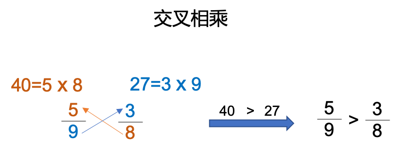
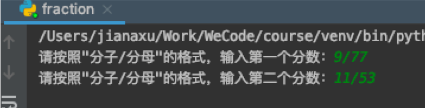

# 第四课 和Python学数学 - 分数比大小

Hi,大家好，我是葫芦妈妈！又到了和葫芦妈妈一起学编程的时间了！

如果你是三年级及以上的小朋友一定已经学过了分数，初识分数的时候老师会告诉你：把一个整体分成几份，其中一份就是几分之一，两份就是几分之二，等等

随后，有关分数的问题也就随之而来，比如：分数的大小比较，分数的加减乘除运算。。。。今天我们就来说说两个分数的大小比较问题。

## 一、分数比大小的数学解答

### 1、分母相同或者分子相同
当分母相同时，比分子，分子大的分数大，分子小的分数小；   
当分子相同时，比分母，分母小的分数大，分母大的分数小    
<div align="center">

</div>

### 2、分子分母都不同--通分
分子分母都相同时，比较大小非常简单，那如果分子分母都不相同呢？   
分子分母都不相同的时候，只需要利用通分，把分子或者分母变相同，然后再利用前面的原则比较即可。   
至于是通分母还是通分子，根据情况灵活选择，例如下面这个例子    
<div align="center">

</div>

### 3、分子分母都不同--交叉相乘
通分子和通分母可以解决大多数分数比大小问题，但因为要兼顾分子和分母，使用起来不是那么方便，那有没有更加简便的方法呢？     
那现在老师要教给你们一个特别简便快捷的方法——交叉相乘    
来观察下通分母的例子，通分后分子的40和27是怎么来的呢？    
5*8=40，3*9=27，5和3是原分数的分子，9和8是另一个分数的分母，只要用原分数的分子乘另一个分数的分母，再比较两个乘积的大小，即可比较出原分数的大小，这个方法就是交叉相乘
<div align="center">

</div>

## 二、分数比大小的编程实现
下面我们就使用交叉相乘的原理，用编程来实现两个分数比大小    

### step1、输入
首先我们需要用户从键盘输入两个分数，既然有输入，就需要变量，我们来创建两个变量m和n用来存放两个分数，还记得使用哪条语句获取用户的输入吗？  
在我们前面的课程中学习过使用input语句接收用户输入的数据，请你跟着老师一起在编辑器中输入下面两行代码：     
```Python
m = input('请按照"分子/分母"的格式，输入第一个分数：')
n = input('请按照"分子/分母"的格式，输入第二个分数：')
```
需要注意的是：input后面的括号和引号一定要在英文输入模式下输入，输入引号中间的文字时注意中英文的切换；    
另外，如果input后面使用了单引号，那“分子/分母”外面的引号要用双引号，反之也一样。     
然后运行一下试试，根据提示，我们输入两个分数：    
<div align="center">

</div>

### step2、获得分子分母，交叉相乘
#### 字符串切片split

现在我们就得到了两个代表分数的字符串，为了后面的计算，我们需要将分数的分子和分母从字符串中拆开，这里老师要教你们一个新的语句——split()。     
split()语句可以通过指定的分隔符将字符串分开，生成一个字符串列表。比如字符串’A#B#C#D’使用split(‘#’)语句，就可以得到一个字符串组成的列表[‘A’,’B’,’C’,’D’]     
<div align="center">

</div>

我们输入分数的时候分子分母是用“/”分隔的，所以我们只要把split(‘/’)，加到代表分数的字符串变量后面，就可以得到包含此分数分子和分母的列表了，就像这样：
```Python
m.split('/')
n.split('/')
```
再找个变量存起来，然后打印出来看看，分子分母是不是分开了呢？  
```Python
m = input('请按照"分子/分母"的格式，输入第一个分数：')
n = input('请按照"分子/分母"的格式，输入第二个分数：')
mList = m.split('/')
nList = n.split('/')
print(mList)
print(nList)

```


## 小结：
现在你应该：

* 熟悉了两个分数比较大小的几种方法：同分母比分子、同分母比分子、通分和交叉相乘
* 学会了使用Python，利用交叉相乘的原理，写一段两个分数比较大小的代码
* 初步认识了列表，这种Python中常用的数据结构
* 复习了单分支选择结构的实现方式——if语句，又学习了双分支和多分支的选择结构，第一次使用if…elif…else实现了多种选择
* 认识到Python可以帮你解决数学问题，并且准备好尝试下一课更有挑战的内容


