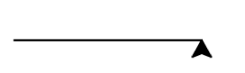
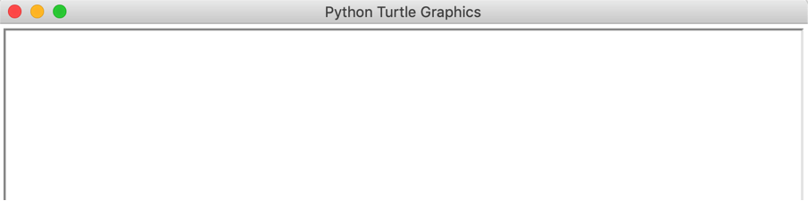
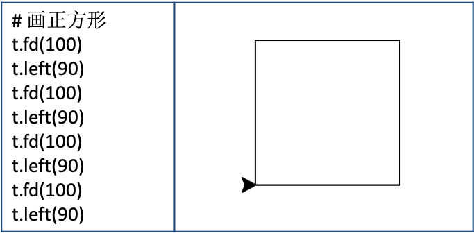
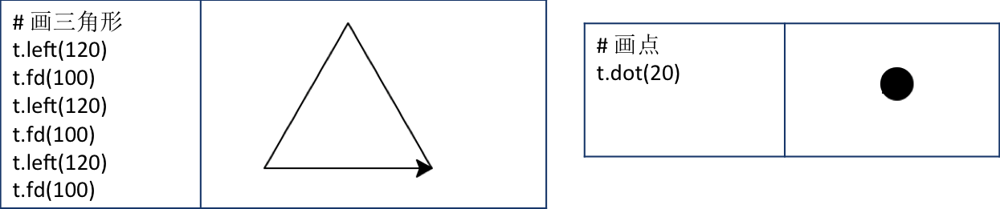
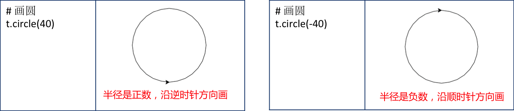
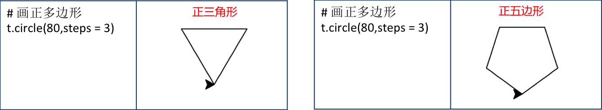

# 第二课 Python会画画-初识海龟画图

Python里有个特别好玩的模块，叫“海龟画图”，英文名是turtle，也就是海龟的意思。使用这个模块，我们可以将屏幕当成画布，通过控制虚拟的海龟画笔在屏幕上来回移动，来绘制线条和图形，这和Scratch中的画笔功能类似。通过编写代码我们就可以绘制出很酷的图片了。

## 准备工作
为了使用turtle模块，得先做点准备工作，首先打开IDLE，File—>New File，调出编辑器，输入下面两行代码：  

```Python
import turtle
t = turtle.Turtle()
```
先要把这个模块导入到我们自己的程序中来，在英语中import代表导入，所以当我们加上了import turtle后，就表示我们的程序可以开始使用海龟作图功能了。     
turtle.Turtle( )是turtle模块中的一个绘图工具，将这个绘图工具赋值给变量t，下面的代码中只需要输入一个字母t就可以了，而不需要每次都输入turtle.Turtle( )。    

## 画正方形
```Python
t.fd( 100 )
t.left( 90 )
```
这句话是告诉计算机让画笔前进100像素，fd 是英文forward的缩写，代表前进，这里你也可以直接使用forward。像素是计算机中标记图像尺寸的基本单位，你只要记住这个单位名称就好了，并不需要把他写到代码中。  
   
下面一句t.left( )表示让小海龟左转，括号里同样要告诉他一个数字，代表转弯的角度，比如填上90，他就向左转了90度。 
       
运行一下吧，现在屏幕上就得到了一条直线和一个头朝上的小箭头。    

<div align="center">

</div>

程序执行时，会弹出turtle的绘图窗口，执行完成后这个窗口自动关闭
<div align="center">

</div>

为了便于观察，我们需要这个窗口一直保留，所以需要在代码最下面加上一句turtle.done()
```Python
import turtle
t = turtle.Turtle( )
t.fd( 100 )
t.left( 90 )
turtle.done()
```

如果我们让画笔按照 向前100像素然后左转90度 这个方式走4次就可以得到一个正方形，就像是围绕一栋建筑连续4次左转的话，将会带我们绕建筑转一圈，并回到起点一样。
<div align="center">

</div>


## 画简单的几何图形

当然，你还可以画出更多的图形，比如三角形、点、圆、正多边形等：
<div align="center">



</div>


## 完整代码：

```Python
# 导入turtle模块
import turtle
# 调用画笔
t= turtle.Turtle()
# 画正方形
t.fd(100)
t.left(90)
t.fd(100)
t.left(90)
t.fd(100)
t.left(90)
t.fd(100)
t.left(90)
t.reset()
# 画三角形
t.left(120)
t.fd(100)
t.left(120)
t.fd(100)
t.left(120)
t.fd(100)
t.reset()
# 画圆
t.circle(40)
t.circle(-40)
t.reset()
# 画正多边形
t.circle(40, steps=5)
t.reset()
t.circle(-40, steps=3)
t.reset()
# 画点
t.dot(20)

turtle.done()
```
将这些代码放到一起，在每个图形的代码后面加上一句 t.reset() ，用来清除画布上已有的图案，当然你也可以不加，叠加在一起的几何图案也很漂亮。   

执行一下看看，小箭头从画布的正中心出发，不停的转来转去，每画完一个图形都会回到起始的原点。   

小箭头画图形的顺序和我们代码中的顺序是完全一致的，从第一行代码开始，自上而下依次执行，所有步骤执行完毕，程序运行结束。这种具有明确顺序性的结构，在程序设计中被称为顺序结构。    

## 小结

现在你应该：   
* 知道如何导入turtle绘图模块
* 学会了使用turtle.Turtle()画笔工具，并且可以用一个简称代替它
* 学会了用turtle画线段、正方形、三角形、点、圆、正多边形等简单的几何图形
* 了解了编程中的顺序结构
* 准备好尝试下一课更有趣的内容