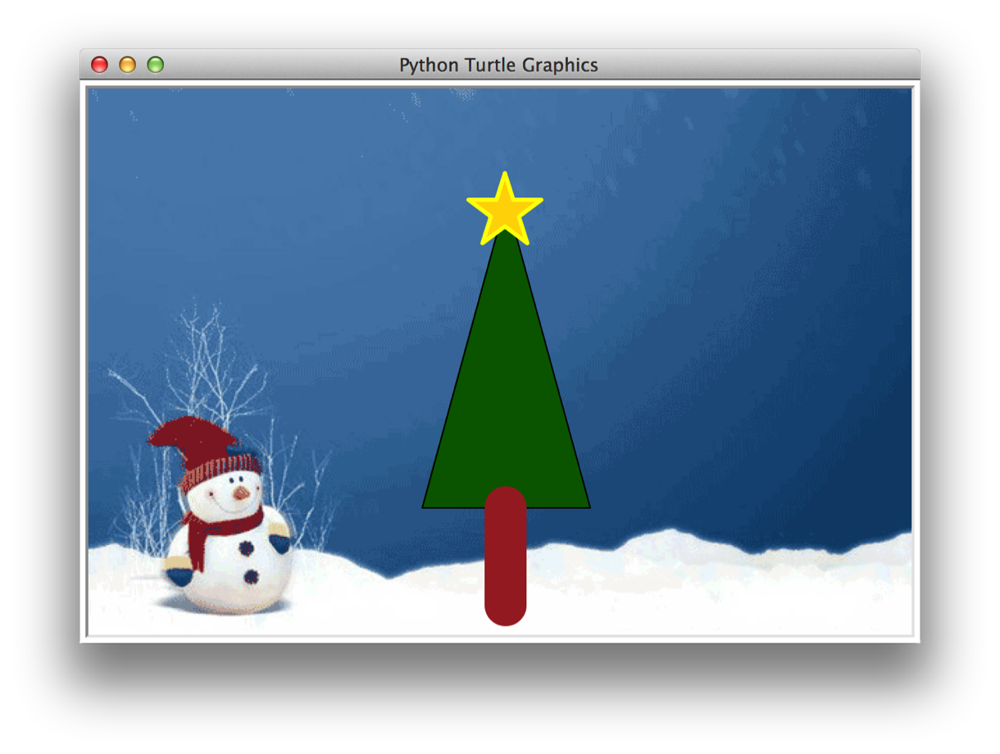

# 第四课 Python会画画-画棵圣诞树吧

Hi,大家好，我是葫芦妈妈。这节课我们要进一步学习turtle的绘图功能，画一棵漂亮的圣诞树，并且给这幅画加一个圣诞主题背景，就像这样

和每次一样，画图前先做准备工作，将turtle模块导入到程序中，然后将绘图工具交给变量t。
<table>
<tr>
<td>第一步，画图准备：</td>
<td width="444px">

</td>
</tr>
</table>