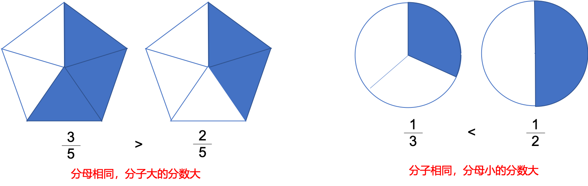
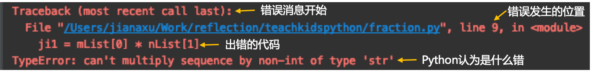
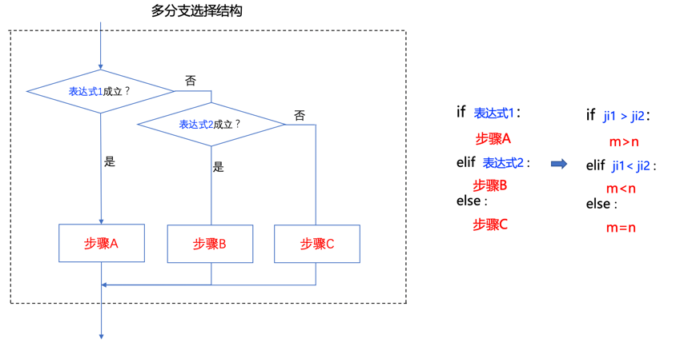

# 第五课 和Python学数学 - 分数比大小

Hi,大家好，我是葫芦妈妈！又到了和葫芦妈妈一起学编程的时间了！

如果你是三年级及以上的小朋友一定已经学过了分数，初识分数的时候老师会告诉你：把一个整体分成几份，其中一份就是几分之一，两份就是几分之二，等等

随后，有关分数的问题也就随之而来，比如：分数的大小比较，分数的加减乘除运算。。。。今天我们就来说说两个分数的大小比较问题。

## 一、分数比大小的数学解答

### 1、分母相同或者分子相同
当分母相同时，比分子，分子大的分数大，分子小的分数小；   
当分子相同时，比分母，分母小的分数大，分母大的分数小    
<div align="center">

</div>

### 2、分子分母都不同--通分
分子分母都相同时，比较大小非常简单，那如果分子分母都不相同呢？   
分子分母都不相同的时候，只需要利用通分，把分子或者分母变相同，然后再利用前面的原则比较即可。   
至于是通分母还是通分子，根据情况灵活选择，例如下面这个例子    
<div align="center">

</div>

### 3、分子分母都不同--交叉相乘
通分子和通分母可以解决大多数分数比大小问题，但因为要兼顾分子和分母，使用起来不是那么方便，那有没有更加简便的方法呢？     
那现在老师要教给你们一个特别简便快捷的方法——交叉相乘    
来观察下通分母的例子，通分后分子的40和27是怎么来的呢？    
5*8=40，3*9=27，5和3是原分数的分子，9和8是另一个分数的分母，只要用原分数的分子乘另一个分数的分母，再比较两个乘积的大小，即可比较出原分数的大小，这个方法就是交叉相乘
<div align="center">

</div>

## 二、分数比大小的编程实现
下面我们就使用交叉相乘的原理，用编程来实现两个分数比大小    

### step1、输入
首先我们需要用户从键盘输入两个分数，既然有输入，就需要变量，我们来创建两个变量m和n用来存放两个分数，还记得使用哪条语句获取用户的输入吗？  
在我们前面的课程中学习过使用input语句接收用户输入的数据，请你跟着老师一起在编辑器中输入下面两行代码：     
```Python
m = input('请按照"分子/分母"的格式，输入第一个分数：')
n = input('请按照"分子/分母"的格式，输入第二个分数：')
```
需要注意的是：input后面的括号和引号一定要在英文输入模式下输入，输入引号中间的文字时注意中英文的切换；    
另外，如果input后面使用了单引号，那“分子/分母”外面的引号要用双引号，反之也一样。     
然后运行一下试试，根据提示，我们输入两个分数：    
<div align="center">

</div>

### step2、获得分子分母，交叉相乘
#### 2.1 字符串切片split

现在我们就得到了两个代表分数的字符串，为了后面的计算，我们需要将分数的分子和分母从字符串中拆开，这里老师要教你们一个新的语句——split()。     
split()语句可以通过指定的分隔符将字符串分开，生成一个字符串列表。比如字符串’A#B#C#D’使用split(‘#’)语句，就可以得到一个字符串组成的列表[‘A’,’B’,’C’,’D’]     
<div align="center">

</div>

我们输入分数的时候分子分母是用“/”分隔的，所以我们只要把split(‘/’)，加到代表分数的字符串变量后面，就可以得到包含此分数分子和分母的列表了，就像这样：
```Python
m.split('/')
n.split('/')
```
再找个变量存起来，然后打印出来看看，分子分母是不是分开了呢？  
```Python
m = input('请按照"分子/分母"的格式，输入第一个分数：')
n = input('请按照"分子/分母"的格式，输入第二个分数：')
mList = m.split('/')
nList = n.split('/')
print(mList)
print(nList)

```
<div align="center">

</div>

#### 2.2 列表
刚才我们说split语句将字符串分割后，会返回一个列表，那小朋友们知道什么是列表吗？   
在我们刚才的例子中以及返回结果里，像这样用方括号括起来、并且每一项之间用逗号隔开的数据类型就是列表：    
<div align="center">

</div>

列表很有用，它可以把一堆相关的数据存在一起，这样我们就可以一次对整个集合做某些处理，也能更容易的记录一组东西，在编程中列表是非常常用的数据类型。      
列表中的每一项称为列表的元素。每个元素可以是整数、浮点数或者是字符串等。    
另外，列表中的每个元素都会分配一个数字来标记它的位置，叫做索引，从0 开始，第一个元素索引是0，第二个元素索引是1….以此类推。   
比如列表mList=[‘9 ’, ‘77’]中第一个元素‘9’要用mList[0]来表示，第二个元素’77’要用mList[1]来表示    
<div align="center">

</div> 

前面我们已经把两个分数转换成了两个列表，所以我们就可以用列表名加索引的方式来引用列表中的数据了    
<div align="center">

</div>
得到了两个分数的分子分母，接下来交叉相乘。    
在交叉相乘中，要注意，左右位置不能弄反，记住口诀：分母随着分子动。       
<div align="center">

</div>

所以这里要用mList[0]*nList[1]得到第一个乘积，用nList[0]*mList[1]得到第二个乘积。     
将两个乘积分别存到变量 ji1 和 ji2 中，然后打印出来看看结果吧    
```Python
m = input('请按照"分子/分母"的格式，输入第一个分数：')
n = input('请按照"分子/分母"的格式，输入第二个分数：')
mList = m.split('/')
nList = n.split('/')
ji1 = mList[0]*nList[1]
ji2 = nList[0]*mList[1]
print(j1)
print(j2)
```

报错了，是不是？你们知道这里为什么会报错嘛？    
编辑器在运行前会对程序做一些检查。当它发现一个错误，就会用红色的字体标记出来，并且告诉你出错的位置和原因     
<div align="center">

</div>

看到错误消息也不用担心，它们只是为了帮你找出哪里出了问题。比如这个错误就是告诉你不能使用字符串类型的数据相乘。    
因为从键盘输入的值是一个字符串，使用split语句分割后，每一项仍然是字符串。    
为了修正这个错误，我们需要在变量外面加上int()，int函数用于将一个数字或者字符串转换成整形。     
修改后再来运行一下，程序是不是正常运行了呢？    
```Python
m = input('请按照"分子/分母"的格式，输入第一个分数：')
n = input('请按照"分子/分母"的格式，输入第二个分数：')
mList = m.split('/')
nList = n.split('/')
ji1 = int(mList[0]) * int(nList[1])
ji2 = int(nList[0]) * int(mList[1])
print(j1)
print(j2)
```
<div align="center">

</div>

#### 2.3 判断大小， if … elif … else 结构
我们通过交叉相乘得到了两个乘积，根据乘积就能比较分数的大小了：   
- 如果乘积 ji1 大于 乘积ji2，则m > n；
- 否则，如果乘积 ji1 小于 乘积ji2，则m < n；
- 否则，只剩下 乘积 ji1 等于 乘积ji2的情况了，则m =n；

<div align="center">

</div>

在程序设计中，程序常常需要对给定的条件做出选择，前面的课程中，我们学习过Python中最简单的一种选择结构——单分支选择结构。     
比如：如果乘积 ji1 大于 乘积ji2，则m > n  
<div align="center">

</div>

但我们还需要一种机制，当条件成立的话做什么，当条件不成立又做什么，我们需要一个“否则的话，怎么怎么样”，这个机制叫else。    
比如：如果乘积 ji1 大于 乘积ji2，则m > n；否则， m < n
<div align="center">

</div>

但这段程序中，我们要判断的不止这些，两个乘积除了大于和小于的情况，还有相等的情况，这又要怎样表达呢？     
Python为我们提供了if … elif … else语句实现多分支选择结构。在我们这个示例中可以这样表达：    
将 ji1 > ji2 和 ji1 < ji2两种情况作为判断条件，分别放到if 和 elif后面进行判断，得到m 大于或者小于 n 的情况，剩余的其他情况就是m等于n了    
<div align="center">

</div>

如果还有更多的条件需要判断，只需要加入多个elif的判断即可。    
这样的选择结构是不是清晰又易懂？你们学会了吗？一起来动手把代码补充完整，将结果打印出来吧    

```Python
# step1.输入分数
m = input('请按照"分子/分母"的格式，输入第一个分数：')
n = input('请按照"分子/分母"的格式，输入第二个分数：')

# step2.获得分子和分母，交叉相乘
mList = m.split('/')
nList = n.split('/')
ji1 = int(mList[0]) * int(nList[1])
ji2 = int(nList[0]) * int(mList[1])

# step3.判断大小
if ji1 > ji2:
    print(m + ' > ' + n)
elif ji1 < ji2:
    print(m + ' < ' + n)
else:
    print(m + ' = ' + n)
```
现在全部代码完成了，运行一下试试看，随意输入两个分数，尤其是比较难于计算的，让程序来帮你解决吧


## 小结：
现在你应该：

* 熟悉了两个分数比较大小的几种方法：同分母比分子、同分母比分子、通分和交叉相乘
* 学会了使用Python利用交叉相乘的原理，写一段两个分数比较大小的代码
* 初步认识了列表，这种Python中常用的数据结构
* 复习了单分支选择结构的实现方式——if语句，又学习了双分支和多分支的选择结构，第一次使用if…elif…else实现了多种选择
* 认识到Python可以帮你解决数学问题，并且准备好尝试下一课更有挑战的内容


